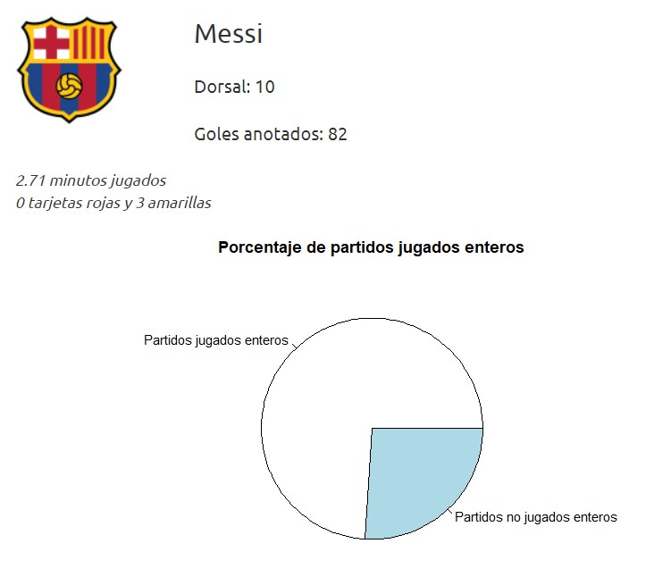
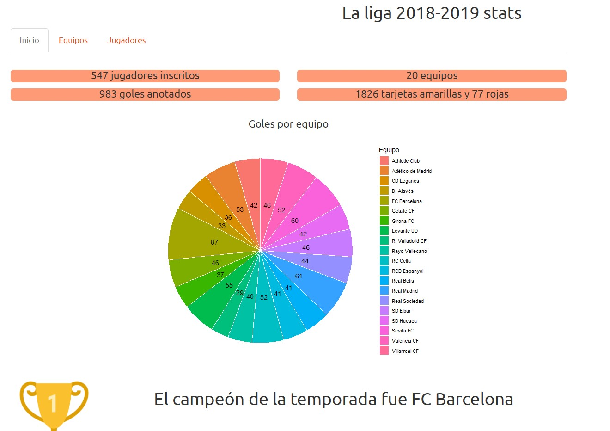
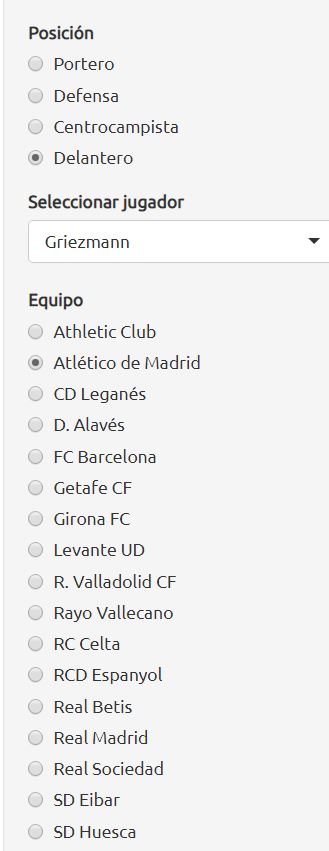
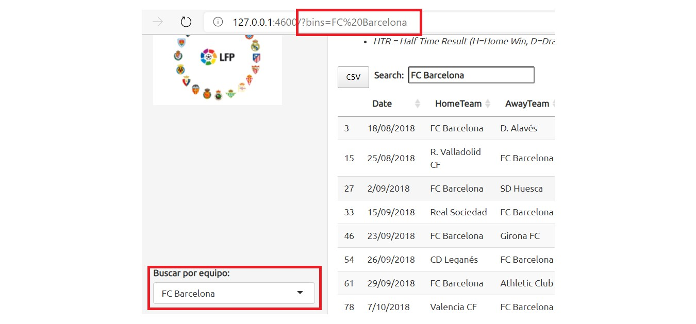
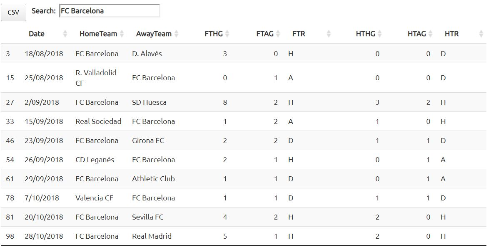

# Parcial 1
Boris Rendón y Lindsey de la Roca
## Parte 2

#### Objetivo

La segunda parte del parcial busca evaluar las competencias adquiridas en la creación de shiny apps. Durante las clases vimos todos los bloques con los que podemos construir pero no los acoplamos, esto es lo que esta parte del parcial busca.

#### Instrucciones
Usted deberá seleccionar un dataset y crear un shiny app que utilice cada una de los conceptos listados a continuación:

<i> El tema del parcial que elegimos es sobre las **estadísticas de LaLiga de la temporada 2018 - 2019.** </i>

La shiny app en general tiene 3 módulos:
* Inicio
    Se muestran estadísticas generales
* Equipos
    Se muestran datos relevantes de juegos
* Jugadores
    Muestra estadísticas de jugadores individuales

1. Tablas

    En la pestaña **Equipos** hay una tabla que representa todos los encuentros que hubo en LaLiga , si ganó el equipo local, su cantidad de goles, los goles de la visita, y el marcador a medio tiempo.

    En la pestaña **Jugadores** luego de filtrar el jugador deseado se muestra una tabla con las estadísticas específicas de ese jugador.

2. Gráficas

    En la pestaña de **Jugadores** se pueden encontrar varias gráficas que muestran estadísticas del jugador seleccionado.


3. Input

    En las pestañas **Equipos** y **Jugadores** se pueden encontrar diversas maneras de ingresar datos para mostrar preferencias de búsqueda.

4. Layouts

    En la pestaña **Inicio** hay algunos datos importantes como el campeón de LaLiga, numero de goles en la temporada, cantidad de tarjetas etc...


5. Interactividad

    En la pestaña **jugador** se puede filtrar por jugador y por posición dentro del campo para el desempeño específico de los jugadores.

6. Reactividad

    Cada vez que se hace un cambio en los input de **Jugadores** estos cambian la selección de nombres de jugadores que podemos buscar.


7. Update Function

    Cuando hacemos una búsqueda en el url se hace un update en la selección de equipos a seleccionar en la pestaña **Equipos**.


8. Parámetros en el URL

Para usar los parámetros (en la pestaña de equipos) desde el URL se debe de hacer de la siguiente manera:
* ```localhost/?bins= equipo a buscar ``` 
* Por ejemplo : ***/localhost/?bins= FC Barcelona***
* 

    Ésto tendrá como resultado un filtro para búsqueda de partidos donde participó ese equipo.
